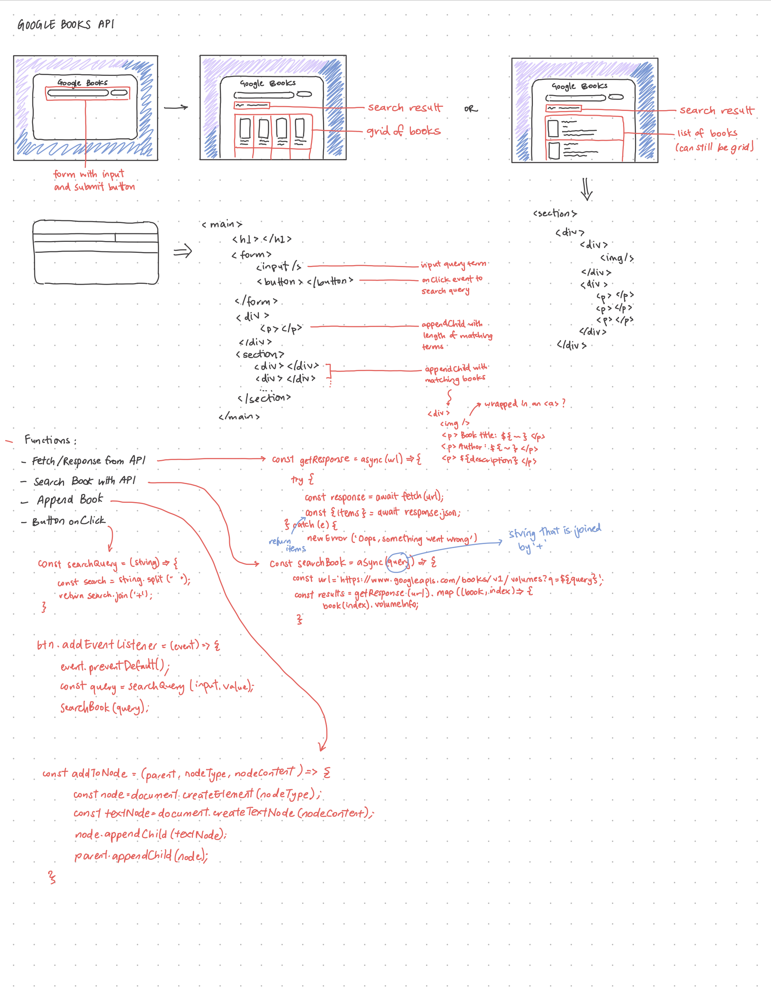

# Google Books API Project

## Planning

Before starting the coding of this project, I once again drafted the overall design as well as doing some handwritten code. I felt that handwriting code was helpful in starting to break down the types of tasks I would need to achieve. As well as this, I am able to think more clearly getting it out in writing rather than starting with code first, and understand the general flow of how everything is meant to work.

For the design, I wanted this app to match the other apps I have created through the \_nology program. So I used the palette I had for my portfolio as the base for my app, and changed up the background gradient, similar to my morse-code translator. I had tossed up whether I wanted to display the books as a grid or as a list, and I felt that from a user experience point-of-view, it would be easier to read the description of the book

## Coding

In implementing the code, I decided to use plain JavaScript over React in order to create this app. I wanted to continue practising with JavaScript and using API's, as this was a fairly new concept to me. With my handwritten draft, the bulk of the code was already done, and so my coding experience was just adjusting and making sure I was getting the results I wanted.

I was quite challenged with creating the book item render as it required me to create an entire card through JavaScript, something I had not done much of before. However, I was able to overcome this in my implementation.

## Code Review

After my code review, I was given advice to refactor my main script, as it was getting too long, and negatively impacting readability. I was able to do this, and this was useful in helping clean up my code.
